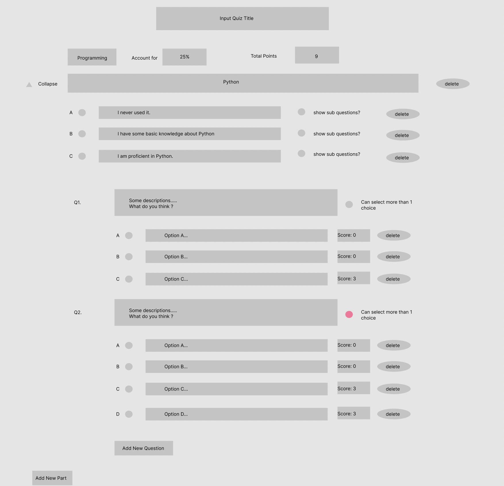

# Quiz Platform

## How an admin create a quiz

A CMS platform will be provided.

### 1. Write a JSON styled data structure and upload it.

```json
{
  "title": "Quiz1.0",
  "description": "This is quiz for test 1.",
  "tag": "test",
  "total_points": 100,
  "domains": [
    {
      "domainName": "Programming",
      "proportion": "25", // this domain accounts for 25% of the total score of the quiz
      "parts": [
        {
          "partName": "Python",
          "choices": [
            {
              "description": "I have never used Python.",
              "willShowSubQuesitons": false
            },
            {
              "description": "I have some basic knowledge about Python.",
              "willShowSubQuesitons": true
            },
            {
              "description": "I am proficient in Python.",
              "willShowSubQuesitons": true
            },
          ],
          "recommendations": [
            {
              // if the user scores less than or equal to 25% of the total points of this part,
              // he/she will be provided by the following link
              "score": 25, 
              "link": "https://www.google.com"
            },
            {
              "score": 50,
              "link": "https://www.google.com"
            },
            {
              "score": 75,
              "link": "https://www.google.com"
            },
            {
              "score": 100,
              "link": "https://www.google.com"
            },
          ]
        },
        {
          // ...other part
        }
      ]
    },
    {
      "domainName": "Tool",
      "proportion": "75", // this domain accounts for 75% of the total score of the quiz
      "parts": [
        // ...
      ]
    },
  ],
}
```

This will initialize a basic structure of the quiz, except detailed questions, which can be added later.

### 2. Edit questions in the admin page



### Other solutoins

It will cost more time and efforts to implement the user interface for editing the quiz questions, as is shown in the picture above.

Another way is to edit the whole quiz by only writing the json file. The data structure will become more complicated. If this is accptable, the implementation will be much easier.

## Databse Design

### Users

```sql
CREATE TABLE
IF NOT EXISTS Users (
	id INT NOT NULL PRIMARY KEY,
	username VARCHAR ( 255 ),
	PASSWORD VARCHAR ( 255 ) 
)
```

### Quizzes

```sql
CREATE TABLE
IF NOT EXISTS Quizzes (
	id INT NOT NULL PRIMARY KEY,
	title VARCHAR ( 255 ),# Quiz title
	tag VARCHAR ( 36 ),# Quiz tag, which will not be exposed to users. This field can be seen as a comment, eg 'tag quiz version1', 'quiz for new grads'.
	description VARCHAR ( 255 ),# descriptions for the Quiz
	total_points INT,# a positive integer, usually set to 100
	detroyed boolean NOT NULL 
)
```

### Domains

```sql
CREATE TABLE
IF NOT EXISTS Domains (
	id INT PRIMARY KEY NOT NULL,
	NAME VARCHAR ( 255 ) NOT NULL,
	proportion INT NOT NULL,
	quiz_id INT NOT NULL,
	createAt char(10), # 10-digit unix TIMESTAMP
	updateAt char(10),
	FOREIGN KEY ( quiz_id ) REFERENCES Quizzes ( id ) 
)
```

### Parts

```sql
CREATE TABLE
IF NOT EXISTS Parts (# eg. Python, R
	id INT NOT NULL PRIMARY KEY,
	NAME VARCHAR ( 255 ),
	description VARCHAR ( 255 ),# descriptions for the Quiz
	detroyed boolean NOT NULL,
	createAt CHAR ( 10 ),# 10-digit unix TIMESTAMP
	updateAt CHAR ( 10 ),
	domain_id INT NOT NULL,
	FOREIGN KEY ( domain_id ) REFERENCES Domains ( id ) 
)
```

### PartChoice

```sql
CREATE TABLE
IF NOT EXISTS PartChoices ( # eg. Python, R
	id INT NOT NULL PRIMARY KEY,
	description VARCHAR(255),
	showSub boolean, # show sub questions if clicked
	seq INT, # sequence number eg: A B C
	createAt char(10), # 10-digit unix TIMESTAMP
	updateAt char(10),
	part_id int not null,
	FOREIGN KEY (part_id) REFERENCES Parts (id)
)
```

### Recommendations

```sql
CREATE TABLE
IF NOT EXISTS Recommendations (# eg. Python, R
	id INT NOT NULL PRIMARY KEY,
	show_under INT,# eg. 25 : show link if final score is lower than 25% of the total points
	link VARCHAR ( 255 ),
	createAt CHAR ( 10 ),# 10-digit unix TIMESTAMP
	updateAt CHAR ( 10 ),
	part_id INT NOT NULL,
	FOREIGN KEY ( part_id ) REFERENCES Parts ( id ) 
)
```

### Questions

```sql
CREATE TABLE
IF NOT EXISTS Questions (
	id INT NOT NULL PRIMARY KEY,
	description VARCHAR ( 1023 ) NOT NULL,# the problem descriptions
	seq INT,
	destroyed boolean,# indicates whether this question is detroyed, or whether it is visible for users
	is_multi, boolean,# indicates if user can select more than one choices
	part_id INT,
  img_src TEXT,
	FOREIGN KEY ( part_id ) REFERENCES Parts ( id ) 
)
```

### Choices

```sql
CREATE TABLE
IF NOT EXISTS Choices (
	id INT NOT NULL PRIMARY KEY,
	description VARCHAR ( 255 ) NOT NULL,
	seq INT, # sequence number of the question, usually from 0 to 3
	question_id INT, # references a question id
	score INT NOT NULL,
	UNIQUE KEY ( seq, question_id ), # make sure sequence number is unique in the question
	FOREIGN KEY ( question_id ) REFERENCES Questions ( id ) 
)
```